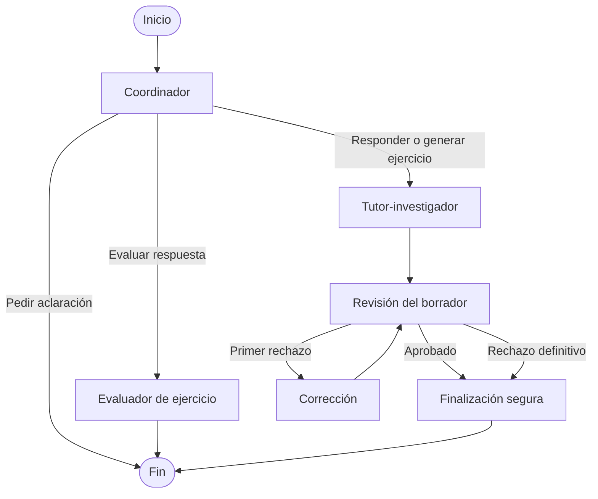

# Tutor técnico multiagente

Proyecto final del nivel experto. Es un tutor de terminal que permite estudiar
Python, Java y Git utilizando documentación oficial, varios agentes
especializados y herramientas web validadas.

El proyecto incluye dos implementaciones de la misma funcionalidad:

- Orquestación manual mediante funciones Python.
- Orquestación mediante LangGraph.

## Funcionalidades

- Responder consultas técnicas con documentación oficial.
- Generar ejercicios adaptados a la petición del estudiante.
- Mantener un ejercicio activo entre turnos.
- Evaluar respuestas mediante una rúbrica privada.
- Buscar documentación mediante Tavily Search.
- Seleccionar páginas relevantes mediante Groq.
- Extraer fragmentos mediante Tavily Extract.
- Revisar los borradores antes de mostrarlos.
- Corregir una vez un borrador rechazado.
- Guardar localmente el progreso de los ejercicios.
- Registrar eventos técnicos mediante logging estructurado.
- Controlar errores externos sin mostrar claves ni trazas.
- Comparar una orquestación manual con una basada en LangGraph.

## Tecnologías admitidas

El alcance está definido en `datos/fuentes_oficiales.json`.

| Tecnología | Dominios oficiales |
|---|---|
| Python | `docs.python.org` |
| Java | `dev.java`, `docs.oracle.com` |
| Git | `git-scm.com` |

Las herramientas validan localmente cada dominio antes de utilizar o entregar
una URL a los agentes.

## Arquitectura multiagente

El sistema utiliza tres agentes:

### 1. Coordinador

Analiza la petición y selecciona una acción:

- `responder_consulta`
- `generar_ejercicio`
- `evaluar_respuesta`
- `pedir_aclaracion`

No responde directamente a la pregunta técnica ni utiliza herramientas.

### 2. Tutor-investigador

Realiza cuatro tareas encadenadas:

1. Buscar documentación oficial.
2. Seleccionar los resultados relevantes.
3. Extraer fragmentos de las páginas seleccionadas.
4. Redactar una explicación o ejercicio con referencias `[fuente-N]`.

También corrige un borrador cuando el evaluador encuentra un problema
material.

### 3. Evaluador

Tiene dos responsabilidades relacionadas, cada una con su propio prompt y
esquema:

- Revisar un borrador antes de mostrarlo.
- Evaluar la respuesta a un ejercicio mediante su rúbrica privada.

El evaluador no reescribe el contenido. Cuando rechaza un borrador, devuelve
instrucciones al tutor-investigador.

## Flujo principal



El ciclo está limitado a:

- Dos revisiones.
- Una corrección.
- Diez pasos internos de LangGraph.

## Estructura principal

```text
nivel_experto/
├── datos/
│   └── fuentes_oficiales.json
├── evaluacion/
│   ├── casos.py
│   ├── casos_prueba.json
│   └── resultados_revision_manual.md
├── tests/
├── tutor_multiagente/
│   ├── agentes/
│   │   ├── cliente_groq.py
│   │   ├── coordinador.py
│   │   ├── esquemas.py
│   │   ├── evaluador.py
│   │   └── tutor_investigador.py
│   ├── herramientas/
│   │   ├── busqueda.py
│   │   ├── extraccion.py
│   │   ├── fuentes.py
│   │   └── progreso.py
│   ├── orquestacion/
│   │   ├── evaluacion.py
│   │   ├── langgraph_tutor.py
│   │   ├── manual.py
│   │   └── revision.py
│   ├── cli_langgraph.py
│   ├── cli_manual.py
│   ├── config.py
│   ├── estado.py
│   ├── logging_config.py
│   └── validadores.py
├── decisiones_tecnicas.md
├── README.md
└── requirements.txt
```

## Requisitos

- Python 3.13 o compatible.
- Una clave de Groq.
- Una clave de Tavily.
- Acceso a Internet para las ejecuciones reales.

Las pruebas automatizadas utilizan clientes simulados y no consumen APIs.

## Instalación

Desde la raíz del repositorio:

```powershell
# Crea el entorno virtual.
python -m venv venv

# Activa el entorno virtual en PowerShell.
.\venv\Scripts\Activate.ps1

# Instala las versiones exactas del proyecto.
python -m pip install -r .\nivel_experto\requirements.txt

# Comprueba que no existan dependencias incompatibles.
python -m pip check
```

## Variables de entorno

Crea un archivo `.env` en la raíz del repositorio:

```dotenv
# Clave utilizada por los tres agentes.
GROQ_API_KEY=tu_clave_de_groq

# Clave utilizada por Tavily Search y Tavily Extract.
TAVILY_API_KEY=tu_clave_de_tavily
```

El archivo `.env` está excluido mediante `.gitignore` y no debe subirse a
GitHub.

## Ejecutar la versión manual

Desde la raíz del repositorio:

```powershell
# Inicia la orquestación construida con funciones Python.
python -m nivel_experto.tutor_multiagente.cli_manual
```

## Ejecutar la versión LangGraph

```powershell
# Inicia la misma funcionalidad orquestada mediante LangGraph.
python -m nivel_experto.tutor_multiagente.cli_langgraph
```

En ambas terminales puedes:

- Preguntar sobre Python, Java o Git.
- Pedir un ejercicio.
- Responder al ejercicio activo.
- Escribir `salir` para terminar.

## Comparación de las implementaciones

| Aspecto | Manual | LangGraph |
|---|---|---|
| Control del flujo | Condicionales y funciones explícitas | Nodos y aristas |
| Bucle de revisión | Bucle Python limitado | Ciclo visible en el grafo |
| Comprensión inicial | Más directa | Requiere conocer LangGraph |
| Cantidad de infraestructura | Mayor código propio | El framework gestiona el recorrido |
| Inspección visual | Debe documentarse manualmente | Puede generar Mermaid |
| Agentes y herramientas | Compartidos | Compartidos |
| Estado | `EstadoTutor` | `EstadoGrafoTutor`, basado en `EstadoTutor` |
| Pruebas | Dependencias inyectables | Nodos y recorridos inspeccionables |

La versión manual facilita comprender lo que ocurre debajo. LangGraph expresa
mejor las rutas, bifurcaciones y ciclos cuando el flujo crece.

## Visualizar el grafo

```powershell
# Construye el grafo sin ejecutar agentes ni consumir APIs.
python -c "from nivel_experto.tutor_multiagente.orquestacion.langgraph_tutor import crear_grafo_tutor; print(crear_grafo_tutor().get_graph().draw_mermaid())"
```

## Pruebas automatizadas

```powershell
# Ejecuta toda la suite sin consumir Groq ni Tavily.
python -m pytest .\nivel_experto\tests -q
```

Estado de la suite al finalizar el proyecto:

```text
608 passed
```

Las pruebas cubren, entre otros aspectos:

- Validación de entradas, tecnologías y URL.
- Respuestas mal formadas de Groq y Tavily.
- Esquemas Pydantic estrictos.
- Selección y resolución de fuentes.
- Revisión y corrección de borradores.
- Evaluación mediante rúbricas.
- Límite del ciclo.
- Memoria entre turnos.
- Persistencia atómica del progreso.
- Logging sin datos sensibles.
- Rutas manuales y LangGraph.
- Terminales sin APIs externas.
- Casos de evaluación manual.

## Evaluación del agente

Los casos estables están definidos en:

```text
evaluacion/casos_prueba.json
```

La revisión de cada ejecución se registra en:

```text
evaluacion/resultados_revision_manual.md
```

Los casos no comparan una respuesta literal. Utilizan criterios observables
como:

- Acción seleccionada.
- Tecnología detectada.
- Herramientas ejecutadas.
- Dominios utilizados.
- Conceptos que debe contener la respuesta.
- Protección de instrucciones y datos privados.

## Progreso y logging

El progreso se guarda localmente en JSON después de evaluar ejercicios. No se
guardan:

- La respuesta completa del estudiante.
- La solución privada.
- El contenido de las fuentes.
- Las claves de las APIs.

El logging utiliza:

- Consola.
- Archivo rotativo.
- Eventos JSON.
- Una lista cerrada de campos permitidos.

Los directorios generados de progreso y logs están excluidos de Git.

## Limitaciones conocidas

- Groq y Tavily pueden aplicar límites temporales de uso.
- Un turno documentado requiere varias llamadas externas consecutivas.
- No se realizan reintentos automáticos ante HTTP 429.
- El proyecto admite un único estudiante local.
- La corrección semántica continúa dependiendo parcialmente del evaluador.
- El catálogo está limitado actualmente a Python, Java y Git.
- El código enviado por el estudiante se analiza como texto y nunca se ejecuta.

## Decisiones técnicas

Las decisiones de arquitectura, seguridad, evaluación y persistencia están
documentadas en:

```text
decisiones_tecnicas.md
```

La principal mejora futura sería implementar reintentos limitados para fallos
transitorios respetando la información de espera del proveedor, sin convertir
el flujo en un ciclo indefinido.